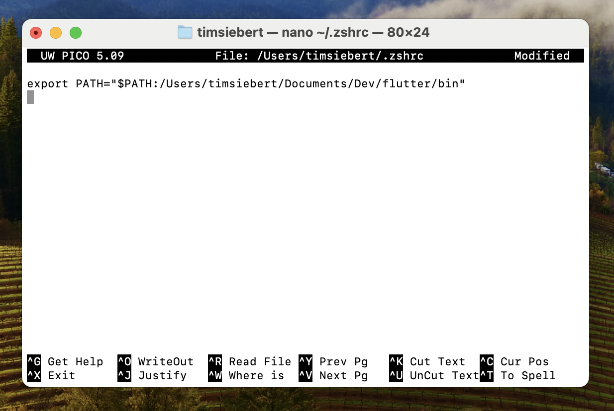

# Installationsguide — Flutter
## Mac
### 1. Download Flutter
> **Intel-Chips**: [Download](https://storage.googleapis.com/flutter_infra_release/releases/stable/macos/flutter_macos_3.13.7-stable.zip) —
 **Apple M-Chips**: [Download](https://storage.googleapis.com/flutter_infra_release/releases/stable/macos/flutter_macos_arm64_3.13.7-stable.zip)

*Download-Datei sollte sich automatisch entpacken.*

### 2. Flutter verschieben

> Der Flutterordner sollte in einen eigenen Ordner verschoben werden. Ich habe es zum Beispiel unter folgendem Pfad: `/Users/timsiebert/Documents/Dev/flutter`

### 3. Flutter zum PATH hinzufügen

> Damit man jederzeit und global den Konsolenbefehl `flutter` ausführen kann, ist es zwingend notwending den Pfad zum Flutterordner zum **PATH** hinzuzufügen

1. **Pfad herausfinden** — 
Gehe in den Flutterordner mittels des Finders und drücke gleichzeitig `Command + Option + P`. Nun sollte der Pfad symbolisch im Finder angezeigt werden. Linksklicke auf das letzte Element `flutter` und wähle `"flutter" als Pfadname kopieren` aus.\
\

2. **Terminal öffnen** —
Terminal über Spotlight / Suche öffnen. Die Suchleiste lässt sich durch das Klicken auf die Linse oben, rechts auf dem Bildschirm öffnen oder durch `Command + Space`. Anschließend `Terminal`eingaben, um das Terminal zu öffnen.

3. **PATH öffnen** —
Durch den Befehl `nano ~/.zshrc` eine neue PATH-Datei anlegen, sofern nicht bereits vorhanden. Folgendes eintragen: `export PATH=”$PATH:[PATH_TO_FLUTTER_GIT_DIRECTORY]/flutter/bin”` Der Mauszeiger funktioniert im Terminal nicht, daher mit den Pfeiltasten navigieren und Pfad ersetzen.\
\

4. **PATH speichern** — 
Weiterhin in der neuen Datei: `Control + X` zum Speichern, `Y` zum bestätigen und `Enter` zum finalen Speichern.

5. **Überprüfen** — Terminal neustarten (schließen und wieder öffnen) und durch `flutter --version` überprüfen ob die Installation erfolgreich war.